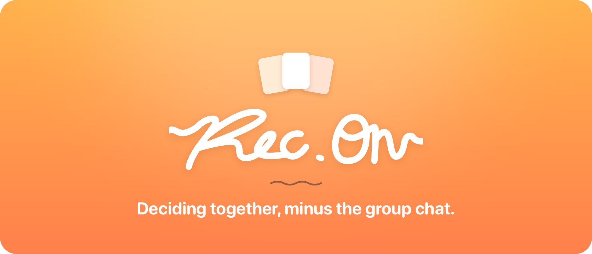
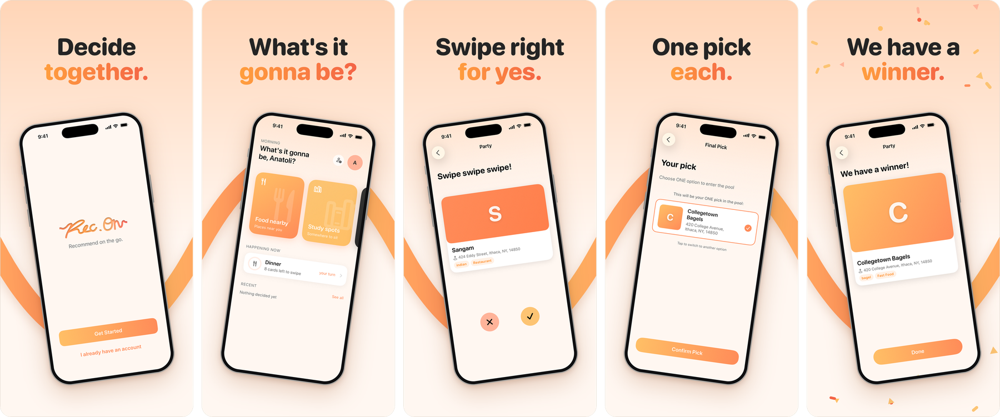
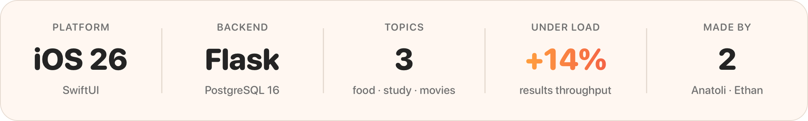

<p align="center">
  
</p>

<p align="center">
  <b>An iOS app for making group decisions.</b><br>
  Swipe through the options, make your pick, and get a winner.<br>
  <sub>By Anatoli Monsalve and Ethan Chen</sub>
</p>

<p align="center">
  <a href="https://www.youtube.com/watch?v=55O7b-9GzwY"></a>
</p>

<p align="center">
  
</p>

<p align="center">
  
</p>

## What it does

Pick a topic, everyone swipes, and the server picks the winner.

The winner is whatever the most people liked. Everyone also submits one final
pick, and ties get drawn with those picks as weights. Something four people
chose beats something nobody chose, even when the likes come out even.

Solo mode is the same rule with one voter. To join a party you need a code from
whoever started it.

## How it is put together

```
recon_frontend/   SwiftUI app
recon_backend/    Flask API, Postgres, migrations
docs/             measurements, credits, README art
```

Nothing that decides anything runs on the phone. The app draws screens and
calls the API. Our first version counted votes in Swift and queried Overpass
straight from the device. Moving all of that to the server was most of the
rewrite.

Three things we spent real time on:

- Tokens sit in the Keychain. Access tokens expire fast and refresh tokens
  rotate on every use.
- Venue lookups go through our server, so there is no third-party key in the
  app bundle. Answers are cached in Postgres for a day.
- We measured the results endpoint instead of guessing at it. Folding three
  aggregate queries and a lazy load into one statement took it from 7 queries
  per request down to 4: +14% throughput and -17% p50 under load. One request
  at a time, it changed nothing. [How we measured it](docs/measurements.md)

## Running it

Backend setup is in [recon_backend/README.md](recon_backend/README.md). Debug
builds look for it on port 5001.

```bash
cd recon_backend
FLASK_APP=wsgi:app ./venv/bin/flask run --port 5001
```

Then open `recon_frontend/recon.xcodeproj` and run.

---

<p align="center"><sub>This is a fresh repo. We had to start over because of too many merge conflicts when trying to combine the parts we built separately.</sub></p>
